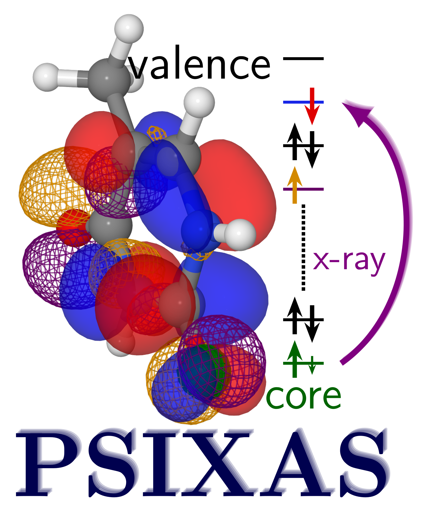
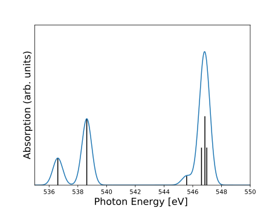

<p align="center">
  
</p>
A Psi4 plugin to calculate X-ray absorption spectra (NEXAFS, PP-NEXAFS, XPS). The implemented methods are based on the Transition-Potential and Delta-Kohn-Sham approach. 

For details, please refer to our paper in the [Journal of Computational Chemistry](https://onlinelibrary.wiley.com/doi/full/10.1002/jcc.26219) and the [documentation](https://psixas.readthedocs.io) (still in progress).

Parts of the program were inspired by the [psi4numpy](https://github.com/psi4/psi4numpy) package.

## Install

### Install PSI4 via Conda (using conda-forge channel)
To install the newest PSI4 version run (see also the PSI4 manual)

```bash
conda create -n psi4-new psi4 python=3.10 cmake eigen pybind11 boost gcc gxx gfortran -c conda-forge
conda activate psi4-new
```

### Install PSIXAS 
To install and use PSIXAS, you will need PSI4 already installed on your computer. You can then checkout the repository:
``` bash
cd /path/to/psi4Plugins/
git clone https://github.com/Masterluke87/psixas/
```
then compile the Plugin:

``` bash
cd psixas
$(psi4 --plugin-compile)
make 
```
## Run the Plugin
To run the plugin you just have to set the PYTHONPATH variable:
``` bash
export PYTHONPATH=/path/to/psi4Plugins
```


## Example: O-K edge of water
The following input file will perform first a ground state and then a transition potential calculation.
``` 
import psixas

molecule {
  O   0.27681793323501      0.00000014791107      0.00000000000000
  H   0.86159097690242      0.76505117501585      0.00000000000000
  H   0.86159108986257     -0.76505132292693      0.00000000000000
symmetry c1
}

set {
  basis def2-TZVP
}


set scf {
 reference uks
 scf_type MEM_DF
}

set psixas {
  prefix WATER
  MODE GS+EX+SPEC
  ORBS [0  ]
  OCCS [0.5]
  SPIN [b  ]
  DAMP 0.8
  OVL    [T]
  FREEZE [T]
}
energy('psixas',functional='PBE')
```
You will find a file named "WATER_b.spectrum" which can be used to plot the spectrum.
<p align="center">
  
</p>
