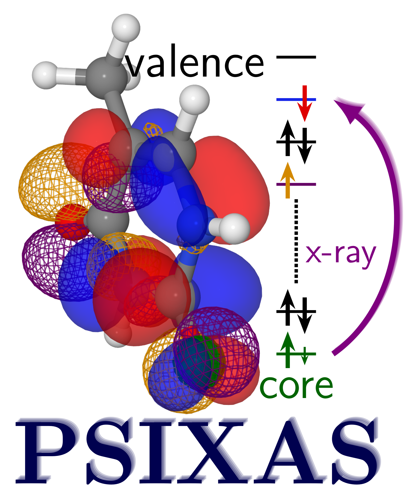

.. PSIXAS documentation master file, created by
   sphinx-quickstart on Fri May 15 09:48:51 2020.
   You can adapt this file completely to your liking, but it should at least
   contain the root `toctree` directive.

Welcome to the documentation of:
==================================

.. toctree::
   :maxdepth: 2
   :caption: Table of Contents

   introduction
   install
   tutorial

Indices and tables
==================

* :ref:`genindex`
* :ref:`modindex`
* :ref:`search`
