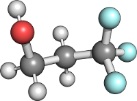

Tutorial
========

Example 1: C1s XPS calculation of 3,3,3-Trifluoropropanol
---------------------------------------------------------

For 3,3,3-Trifluoropropanol one would expect three distinct C1s signals in the XPS spectrum, each signal can be assigned 
to one carbon atom in the molecule.

The central quantity one has to calculate when simulating XPS spectra are the so-called core-electron binding energies (CEBEs).
These can be obtain via a :math:`\Delta`-Kohn-Sham calculation. The CEBE for an excitation center i is given 
as :math:`CEBE = E^{i}_{kat} - E_{neu}`, where :math:`E_{neu}` and :math:`E_{kat}` are the energies of the neutral 
and core-ionized molecule, respectively.

In this example, we are calculating the core electron binding energies with B3LYP/def2-TZVP. In order to get the energy of the 
neutral molecule, we can use the following input:

.. code-block:: bash
    
    import psixas

    memory 16GB

    molecule{
    C           -0.348376548098    -0.548474458915    -0.927836216945
    C            0.598339605925     0.344412190721    -0.154926820251
    C           -1.260377523962    -1.428990131337    -0.073815750620
    H           -0.931459004013     0.095187059173    -1.591052058736
    H            0.270520314607    -1.188949646350    -1.560246367799
    F           -0.030731307342     1.342027128065     0.491810630465
    F            1.492395966346     0.923480284909    -0.991220902737
    F            1.309169804186    -0.344637834439     0.762302565414
    H           -1.792305519830    -2.113716429507    -0.745127437896
    O           -2.163746992897    -0.714605675932     0.750272586920
    H           -0.660551886505    -2.035740348426     0.604285075819
    H           -2.747844602396    -0.181104236356     0.200201028032
    symmetry c1
    }

    set {
    basis def2-TZVP
    }

    set psixas {
    prefix TRIFLUOR
    MODE GS
    }

    set scf {
    reference uks
    scf_type MEM_DF
    }
    energy('psixas',functional='B3LYP')

By the end of the calculation, a Molden file is written, 
which can be used to identify the carbon 1s orbitals. In this case 
they have the indices 4,5 and 6 (if one starts counting at 0).
To calculate the energies of the core ionized states,
one can start a calculation in a separate directory 
(the TRIFLUOR_gsorbs.npz can be copied so that the calculation restarts), or one simply modifies the input file.
The following input can be used to simulate the ionization from orbital 4:

.. code-block:: bash

    import psixas

    memory 16GB

    molecule{
    C           -0.348376548098    -0.548474458915    -0.927836216945
    C            0.598339605925     0.344412190721    -0.154926820251
    C           -1.260377523962    -1.428990131337    -0.073815750620
    H           -0.931459004013     0.095187059173    -1.591052058736
    H            0.270520314607    -1.188949646350    -1.560246367799
    F           -0.030731307342     1.342027128065     0.491810630465
    F            1.492395966346     0.923480284909    -0.991220902737
    F            1.309169804186    -0.344637834439     0.762302565414
    H           -1.792305519830    -2.113716429507    -0.745127437896
    O           -2.163746992897    -0.714605675932     0.750272586920
    H           -0.660551886505    -2.035740348426     0.604285075819
    H           -2.747844602396    -0.181104236356     0.200201028032
    symmetry c1
    }

    set {
    basis def2-TZVP
    }

    set psixas {     
    prefix TRIFLUOR
    MODE GS+EX
    ORBS   [4]
    OCCS   [0.0]
    SPIN   [b]
    FREEZE [T]
    OVL    [T] 
    }

    set scf {
    reference uks
    scf_type MEM_DF
    }
    energy('psixas',functional='B3LYP')

The **MODE** is set to *GS+EX*. This requests a ground state Kohn-Sham (neutral) as well as an excited state 
Kohn-Sham calculation (in this case a cation). 
The **ORBS** keyword sets the index of that orbital, whos occupation number is  modified.
**OCCS** and **SPIN** set the new occupation number and the spin of the orbital.
**FREEZE** and **OVERLAP** indicate that the core orbital is
frozen during the SCF and that the algorithm tries to find it by an overlap criterion. The following lines of the output are important:

.. code-block:: bash

    FINAL EX SCF ENERGY: -481.33260783 [Ha] 
    EXCITATION ENERGY:  10.97109328 [Ha] 
    EXCITATION ENERGY: 298.53864318 [eV] 

where the last line gives us the core electron binding energy. 
The other CEBEs can be calculated similarly, 
only the **OCCS** keyword needs to be modified (to 5 and 6).

+-----------------------+-----------+
| Carbon                | CEBE [eV] |
+-----------------------+-----------+
|:math:`\mathrm{CF_3}`  |   298.5   |
+-----------------------+-----------+
|:math:`\mathrm{CH_2OH}`|   293.2   |
+-----------------------+-----------+
|:math:`\mathrm{CH_2}`  |   292.2   |
+-----------------------+-----------+